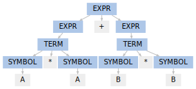
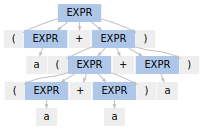
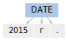
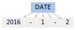
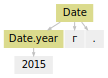
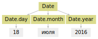
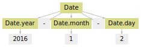

Yargy
=====

Yargy — библиотека для извлечения структурированной информации из
текстов на русском языке. Правила описываются контекстно-свободными
грамматиками и словарями ключевых слов. Банк готовых правил для имён,
дат, адресов, организаций и брендов доступен в репозитории
`Natasha <https://github.com/bureaucratic-labs/natasha>`__.

Для работы с морфологией используется
`Pymorphy2 <http://pymorphy2.readthedocs.io/en/latest/>`__. Парсер
реализует алгоритм `Earley
parser <https://en.wikipedia.org/wiki/Earley_parser>`__. Библиотека
написана на чистом Питоне, поддерживает Python 2.7+ / 3.3+ и Pypy.

Чем Yargy отличается от
`Томита-парсера <https://tech.yandex.ru/tomita/>`__? Эти инструменты
решают одну задачу — извлечение информации из текстов на естественном
языке. Томита-парсер много лет разрабатывался большим количеством людей
внутри Яндекса, объём кода — десятки тысяч строк на C++. Yargy —
библиотека созданная сообществом, написанная на Питоне, объём кода —
несколько тысяч строк. У этих проектов очень много отличий, вот
основные:

-  У Томита-парсера консольный интерфейс, Yargy — это библиотека на
   Питоне
-  В Томита-парсере для описания правил используется свой язык и
   Protobuf-файлы, в Yargy грамматики и словари описываются на Питоне
-  Вместе с Yargy в репозитории
   `Natasha <https://github.com/bureaucratic-labs/natasha>`__
   публикуются готовые правила для извлечения имён, дат, адресов и
   других сущностей. Яндекс не раскрывает свои правила для
   Томита-парсера.
-  Томита-парсер — не очень быстрый, Yargy — вообще не очень быстрый,
   потому что реализован на Питоне, а не на C++ и, наверняка, не так
   хорошо оптимизирован, как Томита-парсер.

.. _examples:

Примеры
-------

Yargy заточен под работу с естественными текстами на русском языке, но
основа библиотеки — обычный
`GLR-парсер <https://en.wikipedia.org/wiki/GLR_parser>`__. Ничего не
мешает написать, например, парсер простых математических выражений:

.. code:: ipython3

    from yargy import Parser, rule, or_, forward
    from yargy.predicates import in_
    
    
    SYMBOL = rule(
        in_('AB')
    ).named('SYMBOL')
    TERM = rule(
        SYMBOL,
        in_('/*'),
        SYMBOL
    ).named('TERM')
    EXPR = forward().named('EXPR')
    EXPR.define(or_(
        SYMBOL,
        TERM,
        rule(
            EXPR,
            in_('+-'),
            EXPR
        )
    ))
    
    
    parser = Parser(EXPR)
    match = next(parser.match('A * A + B * B'))
    match.tree.as_dot

Для работы с русским языком в Yargy встроен морфологический анализатор
`Pymorphy2 <http://pymorphy2.readthedocs.io/en/latest/>`__. Можно,
например, извлечь из текста топонимы, которые начинаются прилагательным
и заканчиваются словами "федерация" или "республика". Например,
"Российская Федерация", "Донецкая народная республика":

.. code:: ipython3

    from yargy import Parser, rule, and_
    from yargy.predicates import gram, is_capitalized, dictionary
    
    
    GEO = rule(
        and_(
            gram('ADJF'),  # так помечается прилагательное, остальные пометки описаны в
                           # http://pymorphy2.readthedocs.io/en/latest/user/grammemes.html
            is_capitalized()
        ),
        gram('ADJF').optional().repeatable(),
        dictionary({
            'федерация',
            'республика'
        })
    )
    
    
    parser = Parser(GEO)
    text = '''
    В Чеченской республике на день рождения ...
    Донецкая народная республика провозгласила ...
    Башня Федерация — одна из самых высоких ...
    '''
    for match in parser.findall(text):
        print([_.value for _ in match.tokens])

.. parsed-literal::

    ['Донецкая', 'народная', 'республика']
    ['Чеченской', 'республике']

Настоящие сложные грамматики для топонимов собраны в репозитории
`Natasha <https://github.com/bureaucratic-labs/natasha>`__

Часто найти подстроку в тексте не достаточно, нужно разбить информацию
на поля и нормализовать. Например, из предложения "12 марта по приказу
президента Владимира Путина ...", извлекается не просто три слова
"президента Владимира Путина", а объект вида
``Person(position='президент', Name(first='Владимир', last='Путин'))``.

.. code:: ipython3

    from yargy import Parser, fact
    from yargy.predicates import gram
    from yargy.pipelines import MorphPipeline
    
    
    Person = fact(
        'Person',
        ['position', 'name']
    )
    Name = fact(
        'Name',
        ['first', 'last']
    )
    
    
    class PositionsPipeline(MorphPipeline):
        grammemes = {'Position'}
        keys = [
            'премьер министр',
            'президент'
        ]
    
    
    NAME = rule(
        gram('Name').interpretation(
            Name.first.inflected()
        ),
        gram('Surn').interpretation(
            Name.last.inflected()
        )
    ).interpretation(
        Name
    )
    PERSON = rule(
        gram('Position').interpretation(
            Person.position.inflected()
        ),
        NAME.interpretation(
            Person.name
        )
    ).interpretation(
        Person
    )
    
    
    parser = Parser(PERSON, pipelines=[PositionsPipeline()])
    text = '''
    12 марта по приказу президента Владимира Путина ...
    '''
    for match in parser.findall(text):
        print(match.fact)

.. parsed-literal::

    Person(position='президент', name=Name(first='владимир', last='путин'))

Полные грамматики для имён и должностей собраны в репозитории
`Natasha <https://github.com/bureaucratic-labs/natasha>`__

.. _start:

Токенизатор
-----------

Парсер работает не с текстом, а с последовательностью токенов.
Встроенный в Yargy токенизатор, работает максимально просто и
предсказуемо. Он не пытается объединять в один токен последовательности
символов типа "Яндекс.Такси", "3.1415", "1 500 000$", "http://vk.com":

.. code:: ipython3

    from yargy.tokenizer import Tokenizer
    
    
    tokenizer = Tokenizer()
    text = '''Ростов-на-Дону
    Длительностью 18ч. 10мин.
    Яндекс.Такси
    π ≈ 3.1415
    1 500 000$
    http://vk.com
    '''
    for line in text.splitlines():
        print([_.value for _ in tokenizer(line)])

.. parsed-literal::

    ['Ростов-на-Дону']
    ['Длительностью', 18, 'ч', '.', 10, 'мин', '.']
    ['Яндекс', '.', 'Такси']
    ['π', '≈', 3, '.', 1415]
    [1, 500, 0, '$']
    ['http', ':', '/', '/', 'vk', '.', 'com']

Для каждого токена делается морфологический анализ, определяется набор
граммем. Например, "NOUN, sing, femn" означает "существительное в
единственном числе женского рода". Вне контекста слово может иметь
несколько вариантов разбора, например, "стали" может быть
существительным (NOUN), как в "марки стали", а может быть глаголом
(VERB), как в "мы стали более лучше":

.. code:: ipython3

    tokenizer = Tokenizer()
    list(tokenizer('марки стали'))

.. parsed-literal::

    [Token('марки',
           (0, 5),
           [Form('марка', {'NOUN', 'femn', 'gent', 'inan', 'sing'}),
            Form('марка', {'NOUN', 'femn', 'inan', 'nomn', 'plur'}),
            Form('марка', {'NOUN', 'accs', 'femn', 'inan', 'plur'}),
            Form('маркий', {'ADJS', 'Qual', 'plur'}),
            Form('марк', {'NOUN', 'Name', 'anim', 'masc', 'nomn', 'plur'})]),
     Token('стали',
           (6, 11),
           [Form('стать', {'VERB', 'indc', 'intr', 'past', 'perf', 'plur'}),
            Form('сталь', {'NOUN', 'femn', 'gent', 'inan', 'sing'}),
            Form('сталь', {'NOUN', 'datv', 'femn', 'inan', 'sing'}),
            Form('сталь', {'NOUN', 'femn', 'inan', 'loct', 'sing'}),
            Form('сталь', {'NOUN', 'femn', 'inan', 'nomn', 'plur'}),
            Form('сталь', {'NOUN', 'accs', 'femn', 'inan', 'plur'})])]

Токенизатор работает на регулярных выражениях. Пользователь может менять стандартные правила и добавлять новые. Как это сделать написано в :ref:`справочнике <tokenizer>`.

В репозитории `models <https://github.com/bureaucratic-labs/models>`__
опубликованы натренированные модели и статистический токенизатор
совместимый с Yargy. Такой токенизатор не будет бить на части слова типа
"яндекс.музыка", "mail.ru". Важно помнить, что грамматики Natasha
разрабатываются и тестируются для стандартного токенизатора с дефолтным
набором правил.

Газеттир
--------

Перед тем, как токены попадают в парсер их обрабатывает газеттир.
Газеттир нужен, например, чтобы объединить несколько токенов в один
мультитокен и добавить граммему в список граммем:

.. code:: ipython3

    from yargy.pipelines import MorphPipeline
    
    
    class Pipeline(MorphPipeline):
        grammemes = {'Type'}
        
        keys = [
            'dvd - диск',
            'видео файл',
            'видеофильм',
            'газета',
            'электронный дневник',
            'эссе',
        ]
        
    
    tokenizer = Tokenizer()
    pipeline = Pipeline()
    text = 'Видео файл на dvd-диске'
    list(pipeline(tokenizer(text)))

.. parsed-literal::

    [Multitoken('Видео файл', (0, 10), [Form('видео файл', {'Type'})]),
     Token('на',
           (11, 13),
           [Form('на', {'PREP'}), Form('на', {'PRCL'}), Form('на', {'INTJ'})]),
     Multitoken('dvd-диске', (14, 23), [Form('dvd - диск', {'Type'})])]

Кроме ``MorphPipeline`` есть ещё ``CaselessPipeline``, о нём написано в :ref:`справочнике <gazetter>`.

Предикаты
---------

Предикат — функция, которая принимает на вход токен и возвращает ``True`` или ``False``. В Yargy встроено много готовых предикатов. Полный список есть в :ref:`справочнике <predicate>`. Предикаты комбинируются с помощью ``and_``, ``or_`` и ``not_``. 

.. code:: ipython3

    from yargy import and_, or_, not_
    from yargy.predicates import gram, is_capitalized
    
    
    tokenizer = Tokenizer()
    token = next(tokenizer('Стали'))
    
    predicate = gram('NOUN')
    assert predicate(token) == True
    
    predicate = gram('VERB')
    assert predicate(token) == True
    
    predicate = and_(
        gram('NOUN'),
        not_(is_capitalized())
    )
    assert predicate(token) == False

Через :func:`~yargy.custom` можно задать предикат с помощью произвольной функции. Например, такой предикат будет срабатывать на римских цифрах:

.. code:: ipython3

    from pymorphy2.shapes import is_roman_number
    
    from yargy.predicates import custom
    
    
    tokenizer = Tokenizer()
    token = next(tokenizer('XL'))
    
    predicate = custom(is_roman_number, types=str)
    assert predicate(token) == True

Грамматики
----------

В Yargy используется специальный DSL для описания грамматик. Любую
контекстно-свободную грамматику можно описать с помощью конструкций
Питона. Например, есть примитивная грамматика для размеров одежды:

::

    KEY -> р. | размер
    VALUE -> S | M | L
    SIZE -> KEY VALUE

Вот так она будет выглядеть в Yargy:

.. code:: ipython3

    from yargy import rule, or_
    
    
    KEY = or_(
        rule('р', '.'),
        rule('размер')
    ).named('KEY')
    VALUE = or_(
        rule('S'),
        rule('M'),
        rule('L'),
    ).named('VALUE')
    SIZE = rule(
        KEY,
        VALUE
    ).named('SIZE')
    SIZE.normalized.as_bnf

.. parsed-literal::

    SIZE -> KEY VALUE
    KEY -> 'р' '.' | 'размер'
    VALUE -> 'S' | 'M' | 'L'

Терминалом может быть не константа, а предикат. Например, правило для
``VALUE`` лучше записать так:

.. code:: ipython3

    from yargy.predicates import in_
    
    
    VALUE = rule(
        in_({'S', 'M', 'L'})
    ).named('VALUE')
    SIZE = rule(
        KEY,
        VALUE
    ).named('SIZE')
    SIZE.normalized.as_bnf

.. parsed-literal::

    SIZE -> KEY VALUE
    KEY -> 'р' '.' | 'размер'
    VALUE -> in_(...)

Как быть, когда правая часть правила ссылается на левую? Например, так:

::

    EXPR -> a | ( EXPR + EXPR )

В Питоне нельзя использовать, переменные, которые ещё не объявлены. Для
создания рекурсивных правил, в DSL есть специальная конструкция
``forward``:

.. code:: ipython3

    from yargy import forward
    
    
    EXPR = forward().named('EXPR')
    EXPR.define(or_(
        rule('a'),
        rule('(', EXPR, '+', EXPR, ')')
    ))
    EXPR.normalized.as_bnf

.. parsed-literal::

    EXPR -> 'a' | '(' EXPR '+' EXPR ')'

Рекурсивные правила позволяют описывать последовательности токенов
произвольной длины. Так, например, выглядит грамматика для текста в
кавычках:

.. code:: ipython3

    from yargy import not_
    from yargy.predicates import eq
    
    
    WORD = not_(eq('»'))
    TEXT = forward()
    TEXT.define(or_(
        rule(WORD),
        rule(WORD, TEXT)
    ))
    TITLE = rule(
        '«',
        TEXT,
        '»'
    ).named('TITLE')
    TITLE.normalized.as_bnf

.. parsed-literal::

    TITLE -> '«' R0 '»'
    R0 -> not_('»') | not_('»') R0

Для удобства в Yargy то же самое можно записать короче:

.. code:: ipython3

    TITLE = rule(
        '«',
        not_(eq('»')).repeatable(),
        '»'
    ).named('TITLE')
    TITLE.as_bnf

.. parsed-literal::

    TITLE -> '«' R0 '»'
    R0 -> not_('»') +

Библиотека автоматически приводит грамматику к простому виду:

.. code:: ipython3

    TITLE.normalized.as_bnf

.. parsed-literal::

    TITLE -> '«' R0 '»'
    R0 -> not_('»') | not_('»') R0

Парсер
------

По аналогии с модулем ``re`` у парсера есть два медота: ``findall`` и
``match``. ``findall`` находит все непересекающиеся подстроки в тексте,
которые удовлетворяют грамматике:

.. code:: ipython3

    parser = Parser(
        or_(
            PERSON,
            TITLE
        ),
        pipelines=[PositionsPipeline()]
    )
    text = 'Президент Владимир Путин в фильме «Интервью с Путиным» ..'
    for match in parser.findall(text):
        print([_.value for _ in match.tokens])

.. parsed-literal::

    ['«', 'Интервью', 'с', 'Путиным', '»']
    ['Президент', 'Владимир', 'Путин']

``match`` — пытается разобрать весь текст целиком:

.. code:: ipython3

    parser = Parser(EXPR)
    match = next(parser.match('(a + ((a + a) + a))'))
    match.tree.as_dot

Интерпретация
-------------

Результат работы парсера — это дерево разбора. Например, так выглядит
грамматика и деревья разбора для дат:

.. code:: ipython3

    from IPython.display import display
    
    from yargy.predicates import (
        lte,
        gte,
        dictionary
    )
    
    
    MONTHS = {
        'январь',
        'февраль',
        'март',
        'апрель',
        'мая',
        'июнь',
        'июль',
        'август',
        'сентябрь',
        'октябрь',
        'ноябрь',
        'декабрь'
    }
    
    
    MONTH_NAME = dictionary(MONTHS)
    MONTH = and_(
        gte(1),
        lte(12)
    )
    DAY = and_(
        gte(1),
        lte(31)
    )
    YEAR = and_(
        gte(1900),
        lte(2100)
    )
    DATE = or_(
        rule(DAY, MONTH_NAME, YEAR),
        rule(YEAR, '-', MONTH, '-', DAY),
        rule(YEAR, 'г', '.')
    ).named('DATE')
    parser = Parser(DATE)
    text = '''2015г.
    18 июля 2016
    2016-01-02
    '''
    for line in text.splitlines():
        match = next(parser.match(line))
        display(match.tree.as_dot)

.. image:: index_files/index_49_1.svg

Интерпретация — процесс преобразования дерева разбора в объект с набором
полей. Для дат, например, нужно получить структуры вида
``Date(year=2016, month=1, day=2)``. Пользователь размечает дерево на
вершины-атрибуты и вершины-конструкторы с помощью метода
``interpretation``:

.. code:: ipython3

    from yargy import fact
    
    
    Date = fact(
        'Date',
        ['year', 'month', 'day']
    )
    
    
    DATE = or_(
        rule(
            DAY.interpretation(
                Date.day
            ),
            MONTH_NAME.interpretation(
                Date.month
            ),
            YEAR.interpretation(
                Date.year
            )
        ),
        rule(
            YEAR.interpretation(
                Date.year
            ),
            '-',
            MONTH.interpretation(
                Date.month
            ),
            '-',
            DAY.interpretation(
                Date.day
            )
        ),
        rule(
            YEAR.interpretation(
                Date.year
            ),
            'г', '.'
        )
    ).interpretation(
        Date
    ).named('DATE')
    
    parser = Parser(DATE)
    for line in text.splitlines():
        match = next(parser.match(line))
        display(match.tree.as_dot)

На основании разметки библиотека собирает объекты:

.. code:: ipython3

    for line in text.splitlines():
        match = next(parser.match(line))
        display(match.fact)

.. parsed-literal::

    Date(year=2015,
         month=None,
         day=None)

.. parsed-literal::

    Date(year=2016,
         month='июля',
         day=18)

.. parsed-literal::

    Date(year=2016,
         month=1,
         day=2)

Подробнее о процессе интерпретации написано в :ref:`справочнике <interpretation>`.

Нормализация
------------

Содержание полей фактов нужно нормировать. Например, не
``Date('июня', 18)``, а ``Date('июнь', 18)``; не
``Person('президента', Name('Владимира', 'Путина'))``, а
``Person('президент', Name('Владимир', 'Путин'))``. В Yargy пользователь
при разметке дерева разбора указывает как просклонять содержание
вершины-атрибута с помощью метода ``inflected``:

.. code:: ipython3

    DATE = rule(
        DAY.interpretation(
            Date.day
        ),
        MONTH_NAME.interpretation(
            Date.month.inflected()
        ),
        YEAR.interpretation(
            Date.year
        )
    ).interpretation(
        Date
    )
    
    parser = Parser(DATE)
    match = next(parser.match('18 июня 2016'))
    match.fact

.. parsed-literal::

    Date(year=2016,
         month='июнь',
         day=18)

Подробнее про нормализацию написано в :ref:`справочнике <normalization>`.

Согласование
------------

Пускай есть примитивная грамматика для извлечения имён:

.. code:: ipython3

    NAME = rule(
        gram('Name').interpretation(
            Name.first.inflected()
        ),
        gram('Surn').interpretation(
            Name.last.inflected()
        )
    ).interpretation(
        Name
    )

У неё есть две проблемы. Она срабатывает на словосочетаниях, где имя и
фамилия в разных падежах:

.. code:: ipython3

    parser = Parser(NAME)
    for match in parser.findall('Илье Ивановым, Павлом Семенов'):
        print([_.value for _ in match.tokens])

.. parsed-literal::

    ['Илье', 'Ивановым']
    ['Павлом', 'Семенов']

Имя и фамилия приводятся к нормальной форме независимо, поэтому,
например, фамилия "Иванову" всегда будет мужского рода:

.. code:: ipython3

    parser = Parser(NAME)
    for match in parser.findall('Сашу Иванову, Саше Иванову'):
        display(match.fact)

.. parsed-literal::

    Name(first='саша',
         last='иванов')

.. parsed-literal::

    Name(first='саше',
         last='иванов')

В Yargy связь между токенами устанавливается методом ``match``. Например, для согласования по числу в ``match`` передаётся :class:`~yargy.number_relation`, для согласования по падежу, роду и числу — :class:`~yargy.gnc_relation`:

.. code:: ipython3

    from yargy.relations import gnc_relation
    
    
    gnc = gnc_relation()
    
    NAME = rule(
        gram('Name').match(gnc).interpretation(
            Name.first.inflected()
        ),
        gram('Surn').match(gnc).interpretation(
            Name.last.inflected()
        )
    ).interpretation(
        Name
    )

.. code:: ipython3

    parser = Parser(NAME)
    for match in parser.findall('Илье Ивановым, Павлом Семенов, Саша Быков'):
        print([_.value for _ in match.tokens])

.. parsed-literal::

    ['Саша', 'Быков']

.. code:: ipython3

    parser = Parser(NAME)
    for match in parser.findall('Сашу Иванову, Саше Иванову'):
        display(match.fact)

.. parsed-literal::

    Name(first='саша',
         last='иванова')

.. parsed-literal::

    Name(first='саша',
         last='иванов')

Полный список типов согласований есть в :ref:`справочнике <relation>`.
