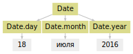
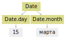
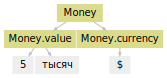
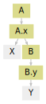
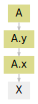
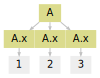
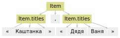
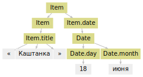

Справочник
==========

В справочнике описаны детали использования основных компонент Yargy: токенизатор, газеттир, предикаты, грамматики, согласование. Чтобы получить общее представление о библиотеке, лучше обратиться к :ref:`разделу с примерами <examples>` и ":ref:`быстрому старту <start>`".

.. _tokenizer:

Токенизатор
-----------

Токенизатор реализован на регулярных выражениях. Для каждого типа
токенов есть своё правило со своей регуляркой:

.. code:: ipython3

    from yargy.tokenizer import DEFAULT_RULES
    
    
    DEFAULT_RULES

.. parsed-literal::

    [RussianRule('[а-яё][а-яё\\-]*', set()),
     LatinRule("[a-z]\\-?[a-z\\']*", {'LATN'}),
     IntRule('\\d+', {'INT', 'NUMBER'}),
     QuoteRule('["\\\'«»„“ʼʻ”]', set()),
     PunctuationRule('[-\\\\/!#$%&()\\[\\]\\*\\+,\\.:;<=>?@^_`{|}~№…]', {'PUNCT'}),
     EOLRule('[\n\r]+', {'END-OF-LINE'}),
     OtherRule('\\S', {'OTHER'})]

Токенизатор инициализируется списком правил. По-умолчанию — это
``DEFAULT_RULES``:

.. code:: ipython3

    from yargy.tokenizer import Tokenizer
    
    
    text = 'a@mail.ru'
    tokenizer = Tokenizer()
    list(tokenizer(text))

.. parsed-literal::

    [Token('a', (0, 1), [Form('a', {'LATN'})]),
     Token('@', (1, 2), [Form('@', {'PUNCT'})]),
     Token('mail', (2, 6), [Form('mail', {'LATN'})]),
     Token('.', (6, 7), [Form('.', {'PUNCT'})]),
     Token('ru', (7, 9), [Form('ru', {'LATN'})])]

Пользователь может убрать часть правил из списка или добавить новых:

.. code:: ipython3

    from yargy.tokenizer import LatinRule
    
    
    tokenizer = Tokenizer([LatinRule()])
    list(tokenizer(text))

.. parsed-literal::

    [Token('a', (0, 1), [Form('a', {'LATN'})]),
     Token('mail', (2, 6), [Form('mail', {'LATN'})]),
     Token('ru', (7, 9), [Form('ru', {'LATN'})])]

Например, в Yargy есть примитивные правила для токенизации емейлов и
телефонов. По-умолчанию они не используются:

.. code:: ipython3

    from yargy.tokenizer import EmailRule, PhoneRule
    
    
    text = 'email: ab@mail.ru call: 8 915 132 54 76'
    tokenizer = Tokenizer(
        [EmailRule(), PhoneRule()]
        + DEFAULT_RULES
    )
    list(tokenizer(text))

.. parsed-literal::

    [Token('email', (0, 5), [Form('email', {'LATN'})]),
     Token(':', (5, 6), [Form(':', {'PUNCT'})]),
     Token('ab@mail.ru', (7, 17), [Form('ab@mail.ru', {'EMAIL'})]),
     Token('call', (18, 22), [Form('call', {'LATN'})]),
     Token(':', (22, 23), [Form(':', {'PUNCT'})]),
     Token(' 8 915 132 54 76', (23, 39), [Form(' 8 915 132 54 76', {'PHONE'})])]

Можно даже запрограммировать своё правило. Например, так выглядит
простое правило для извлечения доменов:

.. code:: ipython3

    from yargy.tokenizer import TokenRule
    
    
    class DomainRule(TokenRule):
        pattern = '[a-zA-Z0-9-]+\.[a-zA-Z0-9-.]+'
        grammemes = {'DOMAIN'}
        
        def normalize(self, value):
            value = value.lower()
            if value.startswith('www.'):
                value = value[4:]
            return value
        
        
    text = 'www.VKontakte.ru'
    tokenizer = Tokenizer(
        [DomainRule()]
        + DEFAULT_RULES
    )
    list(tokenizer(text))

.. parsed-literal::

    [Token('www.VKontakte.ru', (0, 16), [Form('vkontakte.ru', {'DOMAIN'})])]

.. _gazetter:

Газеттир
--------

В Yargy реализовано два типа газеттиров: ``MorphPipeline`` и
``CaselessPipeline``. ``MorphPipeline`` перед работой приводит слова к
нормальной форме:

.. code:: ipython3

    from yargy.pipelines import MorphPipeline
    
    
    class Pipeline(MorphPipeline):
        grammemes = {'Type'}
        
        keys = [
            'электронный дневник',
        ]
        
    
    tokenizer = Tokenizer()
    pipeline = Pipeline()
    text = 'электронным дневником, электронные дневники, электронное дневнику'
    list(pipeline(tokenizer(text)))

.. parsed-literal::

    [Multitoken('электронным дневником',
                (0, 21),
                [Form('электронный дневник', {'Type'})]),
     Token(',', (21, 22), [Form(',', {'PUNCT'})]),
     Multitoken('электронные дневники',
                (23, 43),
                [Form('электронный дневник', {'Type'})]),
     Token(',', (43, 44), [Form(',', {'PUNCT'})]),
     Multitoken('электронное дневнику',
                (45, 65),
                [Form('электронный дневник', {'Type'})])]

Нужно быть аккуратным с пробелами в ``keys``. Слова должны быть
разделены так же, как это бы сделал токенизатор. Например, чтобы
обработать "dvd-диск", в ``keys`` должно быть написано ``dvd - диск``.
Стандартный токенизатор Yargy разбивает "dvd-диск" на три токена.

``CaselessPipeline`` используется, когда слова не нужно приводить к
нормальной форме. Например, есть арабские имена: "Абд Аль-Азиз Бин
Мухаммад", "Абд ар-Рахман Наср ас-Са ди". Их нужно обработать как есть:

.. code:: ipython3

    from yargy.pipelines import CaselessPipeline
    
    
    class Pipeline(CaselessPipeline):
        grammemes = {'Name'}
        keys = [
            'Абд Аль-Азиз Бин Мухаммад',
            'Абд ар-Рахман Наср ас-Са ди',
        ]
        
    tokenizer = Tokenizer()
    pipeline = Pipeline()
    text = 'Абд Аль-Азиз Бин Мухаммад, АБД АР-РАХМАН НАСР АС-СА ДИ'
    list(pipeline(tokenizer(text)))

.. parsed-literal::

    [Multitoken('Абд Аль-Азиз Бин Мухаммад',
                (0, 25),
                [Form('Абд Аль-Азиз Бин Мухаммад', {'Name'})]),
     Token(',', (25, 26), [Form(',', {'PUNCT'})]),
     Multitoken('АБД АР-РАХМАН НАСР АС-СА ДИ',
                (27, 54),
                [Form('Абд ар-Рахман Наср ас-Са ди', {'Name'})])]

.. _predicate:

Предикаты
---------

.. autosummary::
    
   ~yargy.predicates.eq
   ~yargy.predicates.caseless
   ~yargy.predicates.in_
   ~yargy.predicates.gte
   ~yargy.predicates.lte
   ~yargy.predicates.length_eq
   ~yargy.predicates.normalized
   ~yargy.predicates.dictionary
   ~yargy.predicates.gram
   ~yargy.predicates.custom
   ~yargy.predicates.true
   ~yargy.predicates.is_lower
   ~yargy.predicates.is_upper
   ~yargy.predicates.is_title
   ~yargy.predicates.is_capitalized
   ~yargy.predicates.is_single

.. autoclass:: yargy.predicates.eq
.. autoclass:: yargy.predicates.caseless
.. autoclass:: yargy.predicates.in_
.. autoclass:: yargy.predicates.gte
.. autoclass:: yargy.predicates.lte
.. autoclass:: yargy.predicates.length_eq
.. autoclass:: yargy.predicates.normalized
.. autoclass:: yargy.predicates.dictionary
.. autoclass:: yargy.predicates.gram
.. autoclass:: yargy.predicates.custom
.. autoclass:: yargy.predicates.true
.. autoclass:: yargy.predicates.is_lower
.. autoclass:: yargy.predicates.is_upper
.. autoclass:: yargy.predicates.is_title
.. autoclass:: yargy.predicates.is_capitalized
.. autoclass:: yargy.predicates.is_single

.. _interpretation:

Интерпретация
-------------

Схема объекта, который получается в результате интерпретации описывается
конструктором ``fact``. Чтобы задать значение поля по-умолчанию,
используется метод ``attribute``. Например, в ``Date`` по-умолчанию год
будет равен 2017:

.. code:: ipython3

    from IPython.display import display
    from yargy import Parser, rule, fact, attribute, and_, or_
    from yargy.predicates import dictionary, gte, lte
    
    
    Date = fact(
        'Date',
        [attribute('year', 2017), 'month', 'day']
    )
    
    
    MONTHS = {
        'январь',
        'февраль',
        'март',
        'апрель',
        'мая',
        'июнь',
        'июль',
        'август',
        'сентябрь',
        'октябрь',
        'ноябрь',
        'декабрь'
    }
    
    
    MONTH_NAME = dictionary(MONTHS)
    DAY = and_(
        gte(1),
        lte(31)
    )
    YEAR = and_(
        gte(1900),
        lte(2100)
    )
    DATE = rule(
        DAY.interpretation(
            Date.day
        ),
        MONTH_NAME.interpretation(
            Date.month
        ),
        YEAR.interpretation(
            Date.year
        ).optional()
    ).interpretation(
        Date
    )
    
    
    text = '''18 июля 2016
    15 марта
    '''
    parser = Parser(DATE)
    for line in text.splitlines():
        match = next(parser.match(line))
        display(match.fact)

.. parsed-literal::

    Date(year=2016,
         month='июля',
         day=18)

.. parsed-literal::

    Date(year=2017,
         month='марта',
         day=15)

Для дат деревья разбора выглядят просто: вершина-конструктор и несколько
детей-атрибутов:

.. code:: ipython3

    parser = Parser(DATE)
    for line in text.splitlines():
        match = next(parser.match(line))
        display(match.tree.normalized.as_dot)

Как будет себя вести алгоритм интерпретации, когда ребёнок конструктора
не атрибут, а другой конструктор? Или когда ребёнок атрибута другой
атрибут? Или когда под конструктором или атрибутом не одна, а несколько
вершин с токенами? Пойдём от простого к сложному. Когда под
вершиной-атрибутом несколько токенов, они объединяются:

.. code:: ipython3

    from yargy.predicates import eq, gram, dictionary
    
    
    Money = fact(
        'Money',
        ['value', 'currency']
    )
    MONEY = rule(
        rule(
            gram('INT'),
            dictionary({
                'тысяча',
                'миллион'
            })
        ).interpretation(
            Money.value
        ),
        eq('$').interpretation(
            Money.currency
        )
    ).interpretation(
        Money
    )
    
    parser = Parser(MONEY)
    match = next(parser.match('5 тысяч$'))
    match.tree.as_dot

В ``Money.value`` будет два слова:

.. code:: ipython3

    match.fact

.. parsed-literal::

    Money(value='5 тысяч',
          currency='$')

Получить доступ к исходным токенам можно через атрибут ``raw``:

.. code:: ipython3

    match.fact.raw.value

.. parsed-literal::

    Chain([NormalizedToken(RawNormalizer(),
                           Token(5, (0, 1), [Form(5, {'INT', 'NUMBER'})])),
           NormalizedToken(RawNormalizer(),
                           Token('тысяч',
                                 (2, 7),
                                 [Form('тысяча',
                                       {'NOUN',
                                        'femn',
                                        'gent',
                                        'inan',
                                        'plur'})]))])

Когда под вершиной-атрибутом смесь из токенов и вершин-конструктов, они
объединяются в список, а не строку:

.. code:: ipython3

    from yargy.predicates import true
    
    
    A = fact(
        'A',
        ['x']
    )
    B = fact(
        'B',
        ['y']
    )
    RULE = rule(
        true(),
        true().interpretation(
            B.y
        ).interpretation(
            B
        )
    ).interpretation(
        A.x
    ).interpretation(
        A
    )
    
    parser = Parser(RULE)
    match = next(parser.match('X Y'))
    match.tree.as_dot

В ``A.x`` будет список из строки и объекта ``B``:

.. code:: ipython3

    match.fact

.. parsed-literal::

    A(x=['X', B(y='Y')])

Если под вершиной-атрибутом другая вершина-атрибут, нижняя просто
исчезает:

.. code:: ipython3

    from yargy.predicates import true
    
    
    A = fact(
        'A',
        ['x', 'y']
    )
    RULE = true().interpretation(
        A.x
    ).interpretation(
        A.y
    ).interpretation(A)
    
    parser = Parser(RULE)
    match = next(parser.match('X'))
    match.tree.as_dot

"X" попадёт в ``A.y``, не в ``A.x``:

.. code:: ipython3

    match.fact

.. parsed-literal::

    A(x=None,
      y='X')

Что если под вершиной-конструктом несколько одинаковых вершин-атрибутов?
Самый правый атрибут перезаписывает все остальные:

.. code:: ipython3

    A = fact(
        'A',
        ['x']
    )
    RULE = true().interpretation(
        A.x
    ).repeatable().interpretation(
        A
    )
    
    parser = Parser(RULE)
    match = next(parser.match('1 2 3'))
    match.tree.normalized.as_dot

В ``A.x`` попадёт 3:

.. code:: ipython3

    match.fact

.. parsed-literal::

    A(x=3)

Но бывает нужно сохранить содержание всех повторяющихся
вершин-атрибутов, не только самой правой. В этом случае поле помечается
как ``repeatable``:

.. code:: ipython3

    from yargy import not_
    
    
    Item = fact(
        'Item',
        [attribute('titles').repeatable()]
    )
    
    TITLE = rule(
        '«',
        not_(eq('»')).repeatable(),
        '»'
    )
    ITEM = rule(
        TITLE.interpretation(
            Item.titles
        ),
        eq(',').optional()
    ).repeatable().interpretation(
        Item
    )
    
    parser = Parser(ITEM)
    text = '«Каштанка», «Дядя Ваня»'
    match = next(parser.match(text))
    match.tree.normalized.as_dot

«Дядя Ваня» не перезапишет «Каштанка», они оба окажутся в
``Item.titles``:

.. code:: ipython3

    match.fact

.. parsed-literal::

    Item(titles=['«Каштанка»', '«Дядя Ваня»'])

Остался последний неочевидный случай, когда ребёнок
вершины-конструктора, другая вершина-конструктор. Такая ситуация
возникает при использовании рекурсивных грамматик:

.. code:: ipython3

    from yargy import forward, or_
    
    Item = fact(
        'Item',
        ['title', 'date']
    )
    
    ITEM = forward().interpretation(
        Item
    )
    ITEM.define(or_(
        TITLE.interpretation(
            Item.title
        ),
        rule(ITEM, TITLE),
        rule(
            ITEM,
            DATE.interpretation(
                Item.date
            )
        )
    ))
    
    parser = Parser(ITEM)
    text = '«Каштанка» 18 июня'
    match = next(parser.match(text))
    match.tree.normalized.as_dot

В ходе интерпретации появится два объекта:
``Item(title='«Каштанка»', date=None)`` и
``Item(title=None, date=Date(18, 'июня'))``. В конце произойдёт слияние:

.. code:: ipython3

    match.fact

.. parsed-literal::

    Item(title='«Каштанка»',
         date=Date(year=2017,
                   month='июня',
                   day=18))

.. _normalization:

Нормализация
------------

ТОДО про normalized , про raw, про то, что не только для атрибутов можно
указывать, что если несколько токенов под атрибутом, про аргументы в
inflected

.. _relation:

Согласование
------------

ТОДО список case\_relation, number\_relation .. несколько согласований в
одной грамматике , согласование не только токенов
