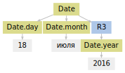
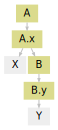
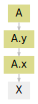
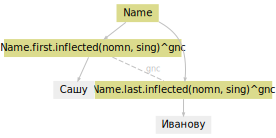

Справочник
==========

В справочнике описаны детали использования основных компонент Yargy: токенизатор, газеттир, предикаты, грамматики, согласование. Чтобы получить общее представление о библиотеке, лучше обратиться к :ref:`разделу с примерами <examples>` и ":ref:`быстрому старту <start>`".

.. _tokenizer:

Токенизатор
-----------

В Yargy токенизатор реализован на регулярных выражениях. Для каждого
типа токенов есть своё правило со своей регуляркой:

.. code:: python

    from yargy.tokenizer import RULES
    
    
    RULES

.. parsed-literal::

    [TokenRule('RU', '[а-яё]+'),
     TokenRule('LATIN', '[a-z]+'),
     TokenRule('INT', '\\d+'),
     TokenRule('PUNCT',
               '[-\\\\/!#$%&()\\[\\]\\*\\+,\\.:;<=>?@^_`{|}~№…"\\\'«»„“ʼʻ”]'),
     TokenRule('EOL', '[\\n\\r]+'),
     TokenRule('OTHER', '\\S')]

Токенизатор инициализируется списком правил. По-умолчанию — это
``RULES``:

.. code:: python

    from yargy.tokenizer import Tokenizer
    
    
    text = 'a@mail.ru'
    tokenizer = Tokenizer()
    list(tokenizer(text))

.. parsed-literal::

    [Token('a', [0, 1), 'LATIN'),
     Token('@', [1, 2), 'PUNCT'),
     Token('mail', [2, 6), 'LATIN'),
     Token('.', [6, 7), 'PUNCT'),
     Token('ru', [7, 9), 'LATIN')]

Пользователь может убрать часть правил из списка или добавить новых.
Например, нужно убрать токены с переводами строк:

.. code:: python

    tokenizer = Tokenizer()
    
    text = '''
    abc
    123
    '''
    list(tokenizer(text))

.. parsed-literal::

    [Token('\n', [0, 1), 'EOL'),
     Token('abc', [1, 4), 'LATIN'),
     Token('\n', [4, 5), 'EOL'),
     Token('123', [5, 8), 'INT'),
     Token('\n', [8, 9), 'EOL')]

Уберём правило для ``'EOL'``:

.. code:: python

    tokenizer = Tokenizer().remove_types('EOL')
    
    list(tokenizer(text))

.. parsed-literal::

    [Token('abc', [1, 4), 'LATIN'), Token('123', [5, 8), 'INT')]

В Yargy есть примитивные правила для токенизации емейлов и телефонов.
По-умолчанию они не используются:

.. code:: python

    from yargy.tokenizer import EMAIL_RULE, PHONE_RULE
    
    
    text = 'email: ab@mail.ru call: 8 915 132 54 76'
    tokenizer = Tokenizer().add_rules(EMAIL_RULE, PHONE_RULE)
    list(tokenizer(text))

.. parsed-literal::

    [Token('email', [0, 5), 'LATIN'),
     Token(':', [5, 6), 'PUNCT'),
     Token('ab@mail.ru', [7, 17), 'EMAIL'),
     Token('call', [18, 22), 'LATIN'),
     Token(':', [22, 23), 'PUNCT'),
     Token(' 8 915 132 54 76', [23, 39), 'PHONE')]

Можно создать и добавить своё правило. Например, так выглядит простое
решение для извлечения доменов:

.. code:: python

    from yargy.tokenizer import TokenRule
    
    
    DOMAIN_RULE = TokenRule('DOMAIN', '[a-zA-Z0-9-]+\.[a-zA-Z0-9-.]+')
    
        
    text = 'на сайте www.VKontakte.ru'
    tokenizer = Tokenizer().add_rules(DOMAIN_RULE)
    list(tokenizer(text))

.. parsed-literal::

    [Token('на', [0, 2), 'RU'),
     Token('сайте', [3, 8), 'RU'),
     Token('www.VKontakte.ru', [9, 25), 'DOMAIN')]

По умолчанию, Yargy использует не ``Tokenizer``, а ``MorphTokenizer``.
Для каждого токена с типом ``'RU'`` он определяет морфологию с помощью
pymorphy2:

.. code:: python

    from yargy.tokenizer import MorphTokenizer
    
    tokenizer = MorphTokenizer()
    list(tokenizer('X век стал'))

.. parsed-literal::

    [Token('X', [0, 1), 'LATIN'),
     MorphToken('век',
                [2, 5),
                'RU',
                [Form('век', Grams(NOUN,inan,masc,nomn,sing)),
                 Form('век', Grams(NOUN,accs,inan,masc,sing)),
                 Form('век', Grams(ADVB)),
                 Form('веко', Grams(NOUN,gent,inan,neut,plur))]),
     MorphToken('стал',
                [6, 10),
                'RU',
                [Form('стать', Grams(VERB,indc,intr,masc,past,perf,sing))])]

.. _gazetter:

Газеттир
--------

При составлении правил часто используются списки слов и словосочетаний.
Например, словарь профессий или географических объектов. Такие правила
можно записывать стандартные средствами через ``rule``, ``or_``,
``normalized``, ``caseless``:

.. code:: python

    from yargy import rule, or_
    from yargy.predicates import normalized, caseless
    
    
    POSITION = or_(
        rule(normalized('генеральный'), normalized('директор')),
        rule(normalized('бухгалтер'))
    )
    
    GEO = or_(
        rule(normalized('Ростов'), '-', caseless('на'), '-', caseless('Дону')),
        rule(normalized('Москва'))
    )

Это неудобно и легко ошибиться. Для составления словарей в Yargy
используется газеттир. Реализовано два типа газеттиров:
``morph_pipeline`` и ``caseless_pipeline``. ``morph_pipeline`` перед
работой приводит слова к нормальной форме:

.. code:: python

    from yargy import Parser
    from yargy.pipelines import morph_pipeline
    
    
    TYPE = morph_pipeline(['электронный дневник'])
    
    parser = Parser(TYPE)
    text = 'электронным дневником, электронные дневники, электронное дневнику'
    for match in parser.findall(text):
        print([_.value for _ in match.tokens])

.. parsed-literal::

    ['электронным', 'дневником']
    ['электронные', 'дневники']
    ['электронное', 'дневнику']

``caseless_pipeline`` используется, когда слова не нужно приводить к
нормальной форме. Например, есть арабские имена: "Абд Аль-Азиз Бин
Мухаммад", "Абд ар-Рахман Наср ас-Са ди". Их нужно обработать как есть:

.. code:: python

    from yargy.pipelines import caseless_pipeline
    
    
    NAME = caseless_pipeline([
        'Абд Аль-Азиз Бин Мухаммад',
        'Абд ар-Рахман Наср ас-Са ди'
    ])
        
    parser = Parser(NAME)
    text = 'Абд Аль-Азиз Бин Мухаммад, АБД АР-РАХМАН НАСР АС-СА ДИ'
    for match in parser.findall(text):
        print([_.value for _ in match.tokens])

.. parsed-literal::

    ['АБД', 'АР', '-', 'РАХМАН', 'НАСР', 'АС', '-', 'СА', 'ДИ']
    ['Абд', 'Аль', '-', 'Азиз', 'Бин', 'Мухаммад']

.. _predicate:

Предикаты
---------

.. autosummary::
    
   ~yargy.predicates.eq
   ~yargy.predicates.caseless
   ~yargy.predicates.in_
   ~yargy.predicates.in_caseless
   ~yargy.predicates.gte
   ~yargy.predicates.lte
   ~yargy.predicates.length_eq
   ~yargy.predicates.normalized
   ~yargy.predicates.dictionary
   ~yargy.predicates.gram
   ~yargy.predicates.type
   ~yargy.predicates.tag
   ~yargy.predicates.custom
   ~yargy.predicates.true
   ~yargy.predicates.is_lower
   ~yargy.predicates.is_upper
   ~yargy.predicates.is_title
   ~yargy.predicates.is_capitalized
   ~yargy.predicates.is_single

.. autoclass:: yargy.predicates.eq
.. autoclass:: yargy.predicates.caseless
.. autoclass:: yargy.predicates.in_
.. autoclass:: yargy.predicates.in_caseless
.. autoclass:: yargy.predicates.gte
.. autoclass:: yargy.predicates.lte
.. autoclass:: yargy.predicates.length_eq
.. autoclass:: yargy.predicates.normalized
.. autoclass:: yargy.predicates.dictionary
.. autoclass:: yargy.predicates.gram
.. autoclass:: yargy.predicates.type
.. autoclass:: yargy.predicates.tag
.. autoclass:: yargy.predicates.custom
.. autoclass:: yargy.predicates.true
.. autoclass:: yargy.predicates.is_lower
.. autoclass:: yargy.predicates.is_upper
.. autoclass:: yargy.predicates.is_title
.. autoclass:: yargy.predicates.is_capitalized
.. autoclass:: yargy.predicates.is_single

.. _interpretation:

Интерпретация
-------------

Схема объекта, который получается в результате интерпретации описывается
конструктором ``fact``. Чтобы задать значение поля по-умолчанию,
используется метод ``attribute``. Например, в ``Date`` по-умолчанию год
будет равен 2017:

.. code:: python

    from IPython.display import display
    from yargy import Parser, rule, and_, or_
    from yargy.interpretation import fact, attribute
    from yargy.predicates import dictionary, gte, lte
    
    
    Date = fact(
        'Date',
        [attribute('year', 2017), 'month', 'day']
    )
    
    
    MONTHS = {
        'январь',
        'февраль',
        'март',
        'апрель',
        'мая',
        'июнь',
        'июль',
        'август',
        'сентябрь',
        'октябрь',
        'ноябрь',
        'декабрь'
    }
    
    
    MONTH_NAME = dictionary(MONTHS)
    DAY = and_(
        gte(1),
        lte(31)
    )
    YEAR = and_(
        gte(1900),
        lte(2100)
    )
    DATE = rule(
        DAY.interpretation(
            Date.day
        ),
        MONTH_NAME.interpretation(
            Date.month
        ),
        YEAR.interpretation(
            Date.year
        ).optional()
    ).interpretation(
        Date
    )
    
    
    text = '''18 июля 2016
    15 марта
    '''
    parser = Parser(DATE)
    for line in text.splitlines():
        match = parser.match(line)
        display(match.fact)

.. parsed-literal::

    Date(year='2016',
         month='июля',
         day='18')

.. parsed-literal::

    Date(year=2017,
         month='марта',
         day='15')

Для дат деревья разбора выглядят просто: вершина-конструктор и несколько
детей-атрибутов:

.. code:: python

    parser = Parser(DATE)
    for line in text.splitlines():
        match = parser.match(line)
        display(match.tree.as_dot)

.. image:: reference_files/reference_34_1.svg

Как будет себя вести алгоритм интерпретации, когда ребёнок конструктора
не атрибут, а другой конструктор? Или когда ребёнок атрибута другой
атрибут? Или когда под конструктором или атрибутом не одна, а несколько
вершин с токенами? Пойдём от простого к сложному. Когда под
вершиной-атрибутом несколько токенов, они объединяются:

.. code:: python

    from yargy.predicates import eq, type, dictionary
    
    
    Money = fact(
        'Money',
        ['value', 'currency']
    )
    MONEY = rule(
        rule(
            type('INT'),
            dictionary({
                'тысяча',
                'миллион'
            })
        ).interpretation(
            Money.value
        ),
        eq('$').interpretation(
            Money.currency
        )
    ).interpretation(
        Money
    )
    
    parser = Parser(MONEY)
    match = parser.match('5 тысяч$')
    match.tree.as_dot

.. image:: reference_files/reference_36_0.svg

В ``Money.value`` будет два слова:

.. code:: python

    match.fact

.. parsed-literal::

    Money(value='5 тысяч',
          currency='$')

Когда под вершиной-атрибутом смесь из токенов и вершин-конструктов,
интерпретация падает:

.. code:: python

    from yargy.predicates import true
    
    
    A = fact(
        'A',
        ['x']
    )
    B = fact(
        'B',
        ['y']
    )
    RULE = rule(
        true(),
        true().interpretation(
            B.y
        ).interpretation(
            B
        )
    ).interpretation(
        A.x
    ).interpretation(
        A
    )
    
    parser = Parser(RULE)
    match = parser.match('X Y')
    match.tree.as_dot

.. code:: python

    # match.fact Будет TypeError

Если под вершиной-атрибутом другая вершина-атрибут, нижняя просто
исчезает:

.. code:: python

    from yargy.predicates import true
    
    
    A = fact(
        'A',
        ['x', 'y']
    )
    RULE = true().interpretation(
        A.x
    ).interpretation(
        A.y
    ).interpretation(A)
    
    parser = Parser(RULE)
    match = parser.match('X')
    match.tree.as_dot

"X" попадёт в ``A.y``, не в ``A.x``:

.. code:: python

    match.fact

.. parsed-literal::

    A(x=None,
      y='X')

Что если под вершиной-конструктом несколько одинаковых вершин-атрибутов?
Самый правый атрибут перезаписывает все остальные:

.. code:: python

    A = fact(
        'A',
        ['x']
    )
    RULE = true().interpretation(
        A.x
    ).repeatable().interpretation(
        A
    )
    
    parser = Parser(RULE)
    match = parser.match('1 2 3')
    match.tree.normalized.as_dot

.. image:: reference_files/reference_47_0.svg

В ``A.x`` попадёт 3:

.. code:: python

    match.fact

.. parsed-literal::

    A(x='3')

Но бывает нужно сохранить содержание всех повторяющихся
вершин-атрибутов, не только самой правой. В этом случае поле помечается
как ``repeatable``:

.. code:: python

    from yargy import not_
    
    
    Item = fact(
        'Item',
        [attribute('titles').repeatable()]
    )
    
    TITLE = rule(
        '«',
        not_(eq('»')).repeatable(),
        '»'
    )
    ITEM = rule(
        TITLE.interpretation(
            Item.titles
        ),
        eq(',').optional()
    ).repeatable().interpretation(
        Item
    )
    
    parser = Parser(ITEM)
    text = '«Каштанка», «Дядя Ваня»'
    match = parser.match(text)
    match.tree.as_dot

.. image:: reference_files/reference_51_0.svg

«Дядя Ваня» не перезапишет «Каштанка», они оба окажутся в
``Item.titles``:

.. code:: python

    match.fact

.. parsed-literal::

    Item(titles=['«Каштанка»', '«Дядя Ваня»'])

Остался последний неочевидный случай, когда ребёнок
вершины-конструктора, другая вершина-конструктор. Такая ситуация
возникает при использовании рекурсивных грамматик. В примере ребёнок
вершины ``Item`` другая вершина ``Item``:

.. code:: python

    from yargy import forward, or_
    
    Item = fact(
        'Item',
        ['title', 'date']
    )
    
    ITEM = forward().interpretation(
        Item
    )
    ITEM.define(or_(
        TITLE.interpretation(
            Item.title
        ),
        rule(ITEM, TITLE),
        rule(
            ITEM,
            DATE.interpretation(
                Item.date
            )
        )
    ))
    
    parser = Parser(ITEM)
    text = '«Каштанка» 18 июня'
    match = parser.match(text)
    match.tree.as_dot

.. image:: reference_files/reference_55_0.svg

В ходе интерпретации появится два объекта:
``Item(title='«Каштанка»', date=None)`` и
``Item(title=None, date=Date('18', 'июня'))``. В конце произойдёт
слияние:

.. code:: python

    match.fact

.. parsed-literal::

    Item(title='«Каштанка»',
         date=Date(year=2017,
                   month='июня',
                   day='18'))

.. _normalization:

Нормализация
------------

В Yargy реализованы четыре основных метода для нормализации:
``normalized``, ``inflected``, ``custom`` и ``const``. ``normalized``
возвращает нормальную форму слова, соответствует ``normal_form`` в
pymorphy2:

.. code:: python

    DATE = rule(
        DAY.interpretation(
            Date.day
        ),
        MONTH_NAME.interpretation(
            Date.month
        ),
        YEAR.interpretation(
            Date.year
        )
    ).interpretation(
        Date
    )
    
    parser = Parser(DATE)
    match = parser.match('8 июня 2015')
    match.fact

.. parsed-literal::

    Date(year='2015',
         month='июня',
         day='8')

С ``normalized`` слово "июня" меняется на "июнь":

.. code:: python

    DATE = rule(
        DAY.interpretation(
            Date.day
        ),
        MONTH_NAME.interpretation(
            Date.month.normalized()
        ),
        YEAR.interpretation(
            Date.year
        )
    ).interpretation(
        Date
    )
    
    parser = Parser(DATE)
    match = parser.match('8 июня 2015')
    match.fact

.. parsed-literal::

    Date(year='2015',
         month='июнь',
         day='8')

Если в ``normalized`` попадает несколько токенов, каждый приводится к
нормальной форме по отдельности:

.. code:: python

    from yargy.interpretation import fact
    from yargy.predicates import normalized
    from IPython.display import display
    
    
    Geo = fact(
        'Geo',
        ['name']
    )
    
    RULE = rule(
        normalized('Красная'),
        normalized('площадь')
    ).interpretation(
        Geo.name.normalized()
    ).interpretation(
        Geo
    )
    
    parser = Parser(RULE)
    for match in parser.findall('на Красной площади'):
        display(match.fact)

.. parsed-literal::

    Geo(name='красный площадь')

Особым образом ведёт себя ``normalized``, когда идёт после газеттира.
Результатом нормализации тогда будет ключ газеттира:

.. code:: python

    from yargy.pipelines import morph_pipeline
    
    RULE = morph_pipeline([
        'красная площадь',
        'первомайская улица'
    ]).interpretation(
        Geo.name.normalized()
    ).interpretation(
        Geo
    )
    
    parser = Parser(RULE)
    for match in parser.findall('c Красной площади на Первомайскую улицу'):
        display(match.fact)

.. parsed-literal::

    Geo(name='красная площадь')

.. parsed-literal::

    Geo(name='первомайская улица')

``inflected`` склоняет слово, соответствует методу ``inflect`` в
pymorphy2:

.. code:: python

    from yargy.interpretation import fact
    from yargy.predicates import gram
    
    Name = fact(
        'Name',
        ['first']
    )
    
    NAME = gram('Name').interpretation(
        Name.first.inflected()
    ).interpretation(
        Name
    )
    
    parser = Parser(NAME)
    for match in parser.findall('Саше, Маше, Вадиму'):
        display(match.fact)

.. parsed-literal::

    Name(first='саша')

.. parsed-literal::

    Name(first='маша')

.. parsed-literal::

    Name(first='вадим')

В качестве аргумента ``inflected`` принимает набор граммем:

.. code:: python

    NAME = gram('Name').interpretation(
        Name.first.inflected({'accs', 'plur'})  # винительный падеж, множественное число
    ).interpretation(
        Name
    )
    
    parser = Parser(NAME)
    for match in parser.findall('Саша, Маша, Вадим'):
        display(match.fact)

.. parsed-literal::

    Name(first='саш')

.. parsed-literal::

    Name(first='маш')

.. parsed-literal::

    Name(first='вадимов')

``custom`` применяет к слову произвольную функцию:

.. code:: python

    from yargy.interpretation import fact
    from yargy.predicates import type
    
    Float = fact(
        'Float',
        ['value']
    )
    
    
    INT = type('INT')
    FLOAT = rule(
        INT,
        '.',
        INT
    ).interpretation(
        Float.value.custom(float)
    ).interpretation(
        Float
    )
    
    parser = Parser(FLOAT)
    match = parser.match('3.1415')
    match.fact

.. parsed-literal::

    Float(value=3.1415)

``custom`` может применяться вместе с ``normalized``. Тогда слово начала
будет поставлено в нормальную форму, потом к нему будет применена
функция:

.. code:: python

    MONTHS = {
        'январь': 1,
        'февраль': 2,
        'март': 3,
        'апрель': 4,
        'мая': 5,
        'июнь': 6,
        'июль': 7,
        'август': 8,
        'сентябрь': 9,
        'октябрь': 10,
        'ноябрь': 11,
        'декабрь': 12
    }
    
    DATE = rule(
        DAY.interpretation(
            Date.day.custom(int)
        ),
        MONTH_NAME.interpretation(
            Date.month.normalized().custom(MONTHS.__getitem__)
        ),
        YEAR.interpretation(
            Date.year.custom(int)
        )
    ).interpretation(
        Date
    )
    
    parser = Parser(DATE)
    match = parser.match('8 июня 2015')
    match.fact

.. parsed-literal::

    Date(year=2015,
         month=6,
         day=8)

``const`` просто заменяет слово или словосочетания фиксированным
значением:

.. code:: python

    Era = fact(
        'Era',
        ['value']
    )
    
    BC = morph_pipeline([
        'до нашей эры',
        'до н.э.'
    ]).interpretation(
        Era.value.const('BC')
    )
    AD = morph_pipeline([
        'наша эра',
        'н.э.'
    ]).interpretation(
        Era.value.const('AD')
    )
    ERA = or_(
        BC,
        AD
    ).interpretation(
        Era
    )
    
    parser = Parser(ERA)
    for match in parser.findall('наша эра, до н.э.'):
        display(match.fact)

.. parsed-literal::

    Era(value='BC')

.. parsed-literal::

    Era(value='AD')

.. _relation:

Согласование
------------

В Yargy реализовано четыре типа согласований: ``gender_relation`` —
согласование по роду, ``number_relation`` — по числу, ``case_relation``
— по падежу, ``gnc_relation`` — по роду, числу и падежу. Ограничение на
правило указывается с помощью метода ``match``:

.. code:: python

    from yargy.relations import gnc_relation
    
    Name = fact(
        'Name',
        ['first', 'last']
    )
    
    gnc = gnc_relation()
    
    NAME = rule(
        gram('Name').interpretation(
            Name.first.inflected()
        ).match(gnc),
        gram('Surn').interpretation(
            Name.last.inflected()
        ).match(gnc)
    ).interpretation(
        Name
    )
    
    parser = Parser(NAME)
    match = parser.match('Сашу Иванову')
    display(match.fact)
    display(match.tree.as_dot)

.. parsed-literal::

    Name(first='саша',
         last='иванова')

Для указания главного слова в фразе используется пометка ``main``.
По-умолчанию главное слово — самое левое:

.. code:: python

    from yargy.relations import main
    
    POSITION = rule(
        normalized('главный'),
        main(normalized('бухгалтер'))
    )
    
    POSITION.as_dot

.. image:: reference_files/reference_83_0.svg

.. code:: python

    from yargy.relations import case_relation
    
    case = case_relation()
    
    PERSON = rule(
        POSITION.match(case),
        NAME.match(case)
    )
    
    
    parser = Parser(PERSON)
    assert not parser.match('главного бухгалтер марину игореву')
    
    match = parser.match('главного бухгалтера марину игореву')
    match.tree.as_dot

.. image:: reference_files/reference_84_0.svg

